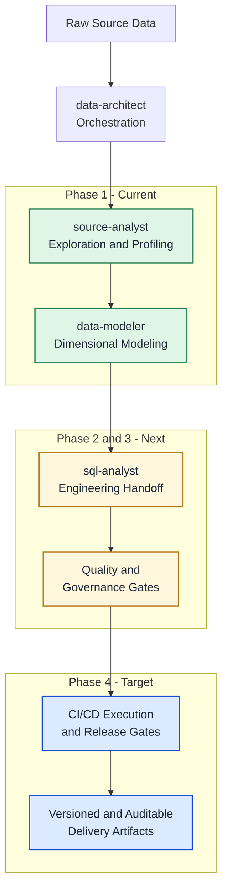

# Data Team Agent

Data Team Agent is a multi-agent framework for standardizing and automating the
data delivery lifecycle. It transforms raw source data into structured,
implementation-ready artifacts with validation gates and a phased path to full
CI/CD orchestration.

## Project Purpose

- Standardize source exploration, dimensional modeling, and mapping outputs.
- Produce consistent artifacts that are easy to review, hand off, and audit.
- Reduce rework through template conformance and automated validation checks.
- Evolve toward end-to-end, CI/CD-driven data delivery automation.

## Current Scope

The current implementation is focused on the front of the lifecycle:

- Source exploration and profiling
- Dimensional modeling and schema design artifacts

Engineering automation, quality governance, and CI/CD orchestration are planned
in subsequent phases.

## Agent Roles

- **data-architect**: Orchestrates phases, delegates work, and coordinates retries.
- **source-analyst**: Profiles source datasets and emits source metadata JSON.
- **data-modeler**: Produces Kimball-style model outputs and Mermaid ERD artifacts.
- **sql-analyst**: Generates source-to-target mapping JSON and Excel workbook output.

## Lifecycle Roadmap

1. **Phase 1 (Current): Exploration + Modeling**
   - Source profiling, metadata capture, and dimensional design artifacts.
2. **Phase 2 (Next): Engineering Handoff Automation**
   - Stronger implementation-ready mappings and handoff contracts.
3. **Phase 3 (Next): Quality and Governance Gates**
   - Semantic/data-quality checks and production-readiness policy gates.
4. **Phase 4 (Target): CI/CD Orchestration**
   - Fully automated execution, retry controls, and release gating.

## Workflow Diagram



Legend: `Current` = active scope, `Next` = planned expansion, `Target` =
end-to-end automation state.

## Repository Structure

```
.
├── .github/
│   └── agents/
│       ├── source-analyst.agent.md
│       ├── data-architect.agent.md
│       ├── data-modeler.agent.md
│       ├── sql-analyst.agent.md
│       ├── templates/
│       │   ├── source_analyzer_output.template.json
│       │   ├── data_modeler_output.template.json
│       │   └── sql_mapping_output.template.json
│       └── toolbox/
│           └── validation/
│               └── validate_output_shapes.py
├── data/
│   ├── sources/
│   └── outputs/
│       ├── metadata/
│       └── files/
└── README.md
```

## How To Run

Invoke the `data-architect` agent with your business context. The orchestrator
delegates work across specialist agents and applies template-based conformance
rules to outputs.

## Validation Gate

Use the validation script to enforce JSON shape conformance before accepting
workflow outputs.

Validator: `.github/agents/toolbox/validation/validate_output_shapes.py`

Run from repository root:

```bash
python .github/agents/toolbox/validation/validate_output_shapes.py --repo-root .
```

Validation behavior:

- Returns `0` when all outputs conform.
- Returns `1` when any output drifts from template shape.
- Reports missing keys and object/array/scalar type mismatches with JSON paths.
- Verifies required artifacts exist:
  - `data/outputs/files/data_model_diagram.mmd`
  - `data/outputs/files/sql_mapping_output.xlsx`

## Key Outputs

- `data/outputs/metadata/source_analyzer_output.json`: Source table metadata and column definitions.
- `data/outputs/metadata/data_modeler_output.json`: Dimensional model metadata and DDL.
- `data/outputs/metadata/sql_mapping_output.json`: Source-to-target mapping with business and pseudo SQL logic.
- `data/outputs/files/data_model_diagram.mmd`: Mermaid ER diagram derived from model outputs.
- `data/outputs/files/sql_mapping_output.xlsx`: Excel workbook for mapping review and handoff.
