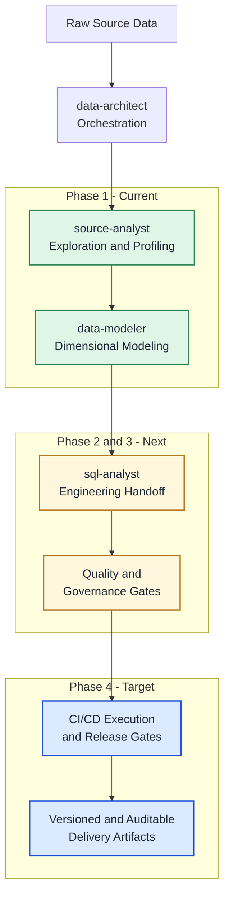

# Data Team Agent

This repository is a multi-agent workflow designed to automate the full data delivery lifecycle, from source exploration and modeling to engineering handoff, quality validation, and CI/CD-driven release readiness.

## End-to-End Automation Goal

The target state for this project is full automation of the data delivery lifecycle:

- Source exploration and profiling
- Dimensional modeling and design artifacts
- Engineering-ready mappings and implementation handoff
- Automated quality checks and output validation
- CI/CD-driven execution, gating, and release readiness

## Progress Roadmap

Current state and planned progression:

1. **Phase 1 (Current): Exploration + Modeling**
   - Focus on source exploration/profiling and dimensional modeling artifacts.
   - Deliverables include source metadata, Kimball model JSON, and Mermaid ERD.
   - Primary value is faster analysis/design with consistent output structures.
2. **Phase 2 (Next): Engineering Handoff Automation**
   - Expand SQL mapping depth and implementation-ready engineering artifacts.
   - Add stronger handoff contracts between modeling outputs and build inputs.
3. **Phase 3 (Next): Quality and Governance Gates**
   - Broaden automated validation beyond output shape to semantic/data-quality checks.
   - Add policy checks and approval gates for production-readiness.
4. **Phase 4 (Target): CI/CD and End-to-End Orchestration**
   - Run full workflow in CI/CD with automated retries, status reporting, and release gates.
   - Treat outputs as versioned, auditable pipeline artifacts.

This roadmap keeps the current implementation practical while preserving a clear
path to complete end-to-end automation.

## Workflow Flow Chart



Legend: `Current` = active implementation scope, `Next` = planned expansion,
`Target` = full end-to-end automation state.

## Available Agents

- **data-architect**: Orchestrates the full workflow, delegates tasks, and retries failed phases.
- **source-analyst**: Profiles source files and emits structured source metadata JSON.
- **data-modeler**: Builds a Kimball-style dimensional model and generates DDL + Mermaid ERD.
- **sql-analyst**: Produces source-to-target SQL mapping JSON and an Excel workbook artifact.

## Workspace Structure

```
Test/
├── .github/
│   └── agents/                          # Agent definitions
│       ├── source-analyst.agent.md      # Analyzes source data → JSON metadata
│       ├── data-architect.agent.md      # Orchestrator/planner for workflow
│       ├── data-modeler.agent.md        # Designs Kimball star schema → SQL DDL
│       ├── sql-analyst.agent.md         # Creates source-to-target mapping JSON
│       └── templates/                   # Reusable JSON templates for agent outputs
│           ├── source_analyzer_output.template.json
│           ├── data_modeler_output.template.json
│           └── sql_mapping_output.template.json
│
├── data/
│   ├── sources/                         # Input: Raw source data files
│   │   ├── sample_sales.csv
│   │   ├── sample_customers.csv
│   │   └── sample_products.csv
│   │
│   └── outputs/                         # Output: Agent results
│       ├── metadata/                    # JSON metadata outputs (template-validated)
│       │   ├── source_analyzer_output.json
│       │   ├── data_modeler_output.json
│       │   └── sql_mapping_output.json
│       └── files/                       # File artifacts derived from metadata
│           ├── data_model_diagram.mmd
│           └── sql_mapping_output.xlsx
│
└── README.md                            # This file
```

## Workflow

Agent definitions and workflow logic are **entirely in `.github/agents/`**.

- **data-architect** – Orchestrates phases; delegates to source-analyst, data-modeler, and sql-analyst
- **source-analyst** – Analyzes sources; outputs JSON metadata under `data/outputs/metadata/`
- **data-modeler** – Designs schema; outputs JSON metadata plus Mermaid ERD (`.mmd`) in `data/outputs/files/`
- **sql-analyst** – Produces source-to-target mapping JSON plus Excel mapping workbook (`.xlsx`) in `data/outputs/files/`

All agents are instructed to **learn from and conform to** JSON templates in `.github/agents/templates/`.

To run the workflow, invoke the data-architect agent with your business context.

## Validation Gate

Use the validation script to enforce JSON output shape conformance against the
agent templates before approving implementation.

**Validator script:** `.github/agents/toolbox/validation/validate_output_shapes.py`

Run from repository root:

```bash
python .github/agents/toolbox/validation/validate_output_shapes.py --repo-root .
```

Behavior:

- Returns exit code `0` when all outputs conform.
- Returns exit code `1` when any output drifts from template shape.
- Reports missing keys and object/array/scalar kind mismatches with JSON paths.
- Verifies required file artifacts exist: `data_model_diagram.mmd` and `sql_mapping_output.xlsx`.

Conformance loop policy:

- Each producing agent must run a draft/fix loop against its template before finalizing output.
- The data-architect orchestrator retries failed phases and feeds failing JSON paths back to the producing agent.
- Workflow approval is blocked until the validator returns exit code `0`.

## File Descriptions

### Sources (`data/sources/`)

- **sample_sales.csv** - Transaction/fact data (7 rows)
- **sample_customers.csv** - Customer dimension data (4 rows)
- **sample_products.csv** - Product dimension data (5 rows)

### Outputs (`data/outputs/`)

- **metadata/source_analyzer_output.json** - Structured metadata of source tables with column definitions
- **metadata/data_modeler_output.json** - Complete Kimball dimensional model with DDL statements
- **metadata/sql_mapping_output.json** - Column-level source-to-target mapping with business and pseudo SQL logic
- **files/data_model_diagram.mmd** - Mermaid ER diagram generated from the modeled schema
- **files/sql_mapping_output.xlsx** - Excel workbook generated from SQL mapping output
